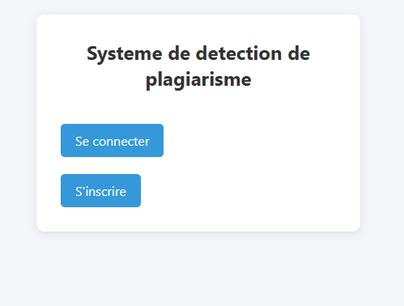
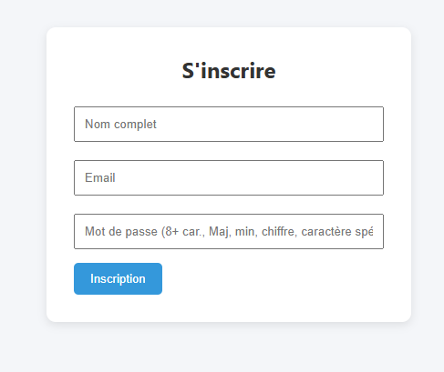
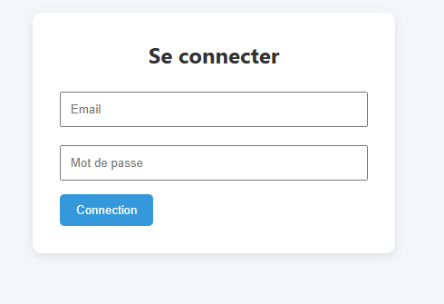
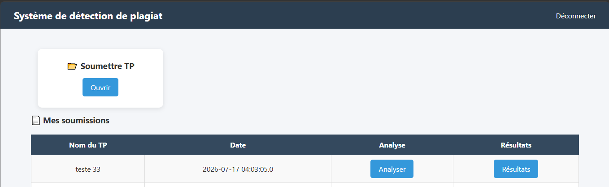
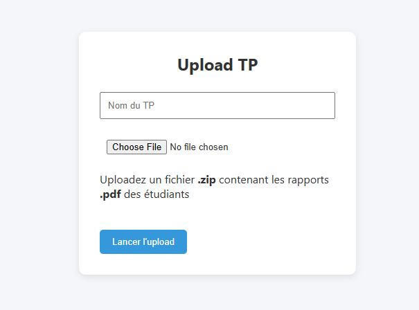
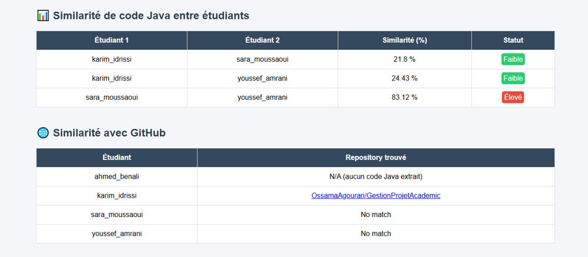
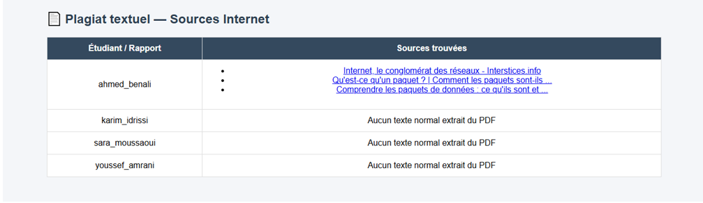

# Plagiarism Detector

> **Academic context:** This project was developed as a **Bachelor's capstone project
> (Projet de Fin d'Études)** for a Bachelor's degree in **Computer Engineering**.

A Java EE application (JSP / Servlets / JDBC / MySQL / Tomcat 9) that lets a user submit
a lab assignment as a ZIP archive containing PDF files, then run a plagiarism analysis
(cross-student comparison, GitHub search, web search) via a Python script.

## Prerequisites

- JDK (8+)
- Apache Tomcat 9
- MySQL / MariaDB
- Python 3 with dependencies: `pip install requests pymupdf`

## 1. Database

Create a `plagiarism_db` database with the following tables:

```sql
CREATE DATABASE IF NOT EXISTS plagiarism_db;
USE plagiarism_db;

CREATE TABLE users (
    id       INT(11) AUTO_INCREMENT PRIMARY KEY,
    name     VARCHAR(100) NOT NULL,
    email    VARCHAR(100) NOT NULL UNIQUE,
    password VARCHAR(255) NOT NULL   -- BCrypt hash, never stored in plain text
);

CREATE TABLE submissions (
    id          INT(11) AUTO_INCREMENT PRIMARY KEY,
    user_id     INT(11) NOT NULL,
    tp_name     VARCHAR(100) NOT NULL,
    file_path   VARCHAR(255),
    upload_date TIMESTAMP DEFAULT CURRENT_TIMESTAMP,
    FOREIGN KEY (user_id) REFERENCES users(id)
);

CREATE TABLE analyses (
    id            INT(11) AUTO_INCREMENT PRIMARY KEY,
    submission_id INT(11) NOT NULL,
    analysis_date TIMESTAMP DEFAULT CURRENT_TIMESTAMP,
    FOREIGN KEY (submission_id) REFERENCES submissions(id)
);
```

> Note: `dao/ResultDAO.java` references a `similarity_results` table that is not used
> in the current flow (analysis results are stored as JSON files under `results/`,
> not in the database). This class is currently dead code and can be ignored or removed.

## 2. Path configuration (`PLAGIARISM_HOME`)

The application needs to know the real location of the project on disk (to find
`uploads/`, `results/` and `python/plagiarism_detector.py`), since Eclipse/Tomcat
deploys the application to a temporary folder different from the project folder.

Set an environment variable (recommended, survives restarts):

- **Windows**: Control Panel → Environment Variables → New user variable
  `PLAGIARISM_HOME` = full project path (e.g. `D:\Dev\detecteur_de_plagiarisme2`)
  → restart Eclipse.

- **Or**, in Eclipse: Servers → double-click the server → *Open launch configuration*
  → *Arguments* tab → add to **VM arguments**:
  ```
  -DPLAGIARISM_HOME="D:\Dev\detecteur_de_plagiarisme2"
  ```

Without this variable, `AppConfig` tries to auto-detect the project folder from the
compiled classes location, which can fail under certain Eclipse WTP deployment setups.

## 3. Secrets (GitHub token, SerpAPI, DB credentials)

No secret is hardcoded in the source code. Two options, pick one:

**Option A — environment variables**
```
GITHUB_TOKEN=...
SERPAPI_KEY=...
DB_URL=jdbc:mysql://localhost:3306/plagiarism_db
DB_USER=root
DB_PASSWORD=...
```

**Option B — local config files (git-ignored, see `.gitignore`)**
- `config.properties` at the project root (copy `config.properties.example`):
  DB credentials + paths.
- `python/config.properties` (copy `python/config.properties.example`):
  `GITHUB_TOKEN` and `SERPAPI_KEY`.

Without any configuration, the defaults are: `root` / empty password /
`localhost:3306/plagiarism_db`, and no GitHub/SerpAPI token (the corresponding
searches are simply skipped with a warning message).

## 4. Running the project

1. Import the project into Eclipse (Dynamic Web Project).
2. Configure `PLAGIARISM_HOME` (step 2).
3. Start the Tomcat server from Eclipse.
4. Open `http://localhost:8080/<project-name>/` → redirects to `auth.jsp`.

## 5. Password policy

At registration, the password must contain at least 8 characters, one uppercase
letter, one lowercase letter, one digit, and one special character. Passwords are
hashed with BCrypt before being stored.

## 6. Results structure

Each analysis produces an independent file: `results/result_<submission_id>.json`.
A user can only analyze or view their own submissions.

## 7. Screenshots

| Home | Sign up | Sign in |
|---|---|---|
|  |  |  |

| Dashboard | Upload | Results |
|---|---|---|
|  |  |  |



## License

This project is licensed under the MIT License.